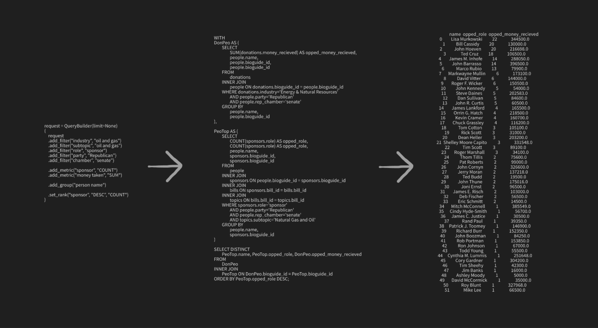

# The Voting Shade
Last updated: 03/11/26

Project to collect data on legislator voting and funding, and bill topics. Intention to bring accountability to Congress and ease access to data through abstraction of database interaction.

### If you find any errors or data collection inaccuracies, please contact thevotingshade@gmail.com

## Table of Contents
1. [Features](#features)
2. [Project Structure](#project-structure)
3. [Data Coverage](#data-coverage)
4. [Recreation steps](#recreation-steps)
5. [To do SQL queries](#to-do-sql-queries)

## Project Structure
```text
.
├── annotation
├── scripts
│   ├── ingest
│   └── parse
└── text2sql
```

## Features

- Data ingestion from FEC, SEC, and Congress datasets
- Parsing of bills, votes, PACs, and transactions
- Bill topic classification using Comparative Agenda Project topics
- Matching Corporate PACs to SEC companies
- Super simple queries → Complex SQL query system



## Data Coverage

- Bills & Votes: 113th–119th Congress (2013–Present)
- Legislators: All with registered bioguide_ids & have sponsored/cosponsored a bill
- PAC Transactions: 1999–2026
## Data Coverage

- Bills & Votes: 113th–119th Congress (2013–Present)
- Legislators: All with registered bioguide_ids & have sponsored/cosponsored a bill
- PAC Transactions: 1999–2026

## Recreation steps

1. Ingest data (make your own UserAgent) (ingest_*.py)
2. Create dataset + train model using annotation/ folder **(MAY BE BUGGY)**
3. Parse data (parse_*.py) (parse_pacs then parse_transactions, parse_bills then parse_votes)

## To do SQL queries

1. Create schema graph if not exists
   python text2sql/make_graph.py

2. Add request to `execute_sql.py`

3. Run query  
   python text2sql/execute_sql.py


1. Create schema graph if not exists
   python text2sql/make_graph.py

2. Add request to `execute_sql.py`

3. Run query  
   python text2sql/execute_sql.py

